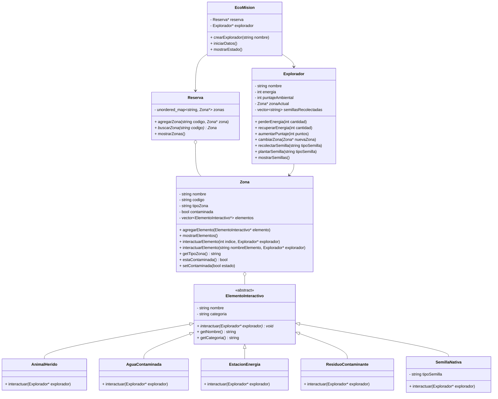
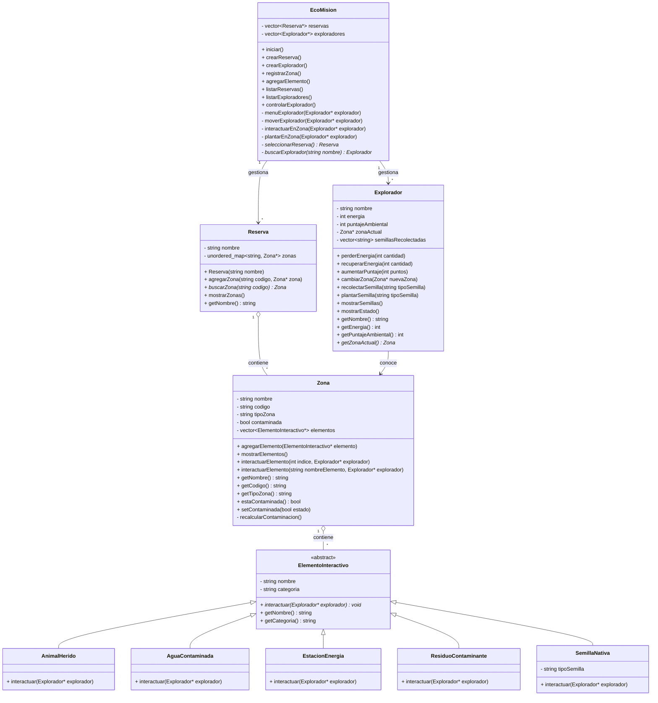
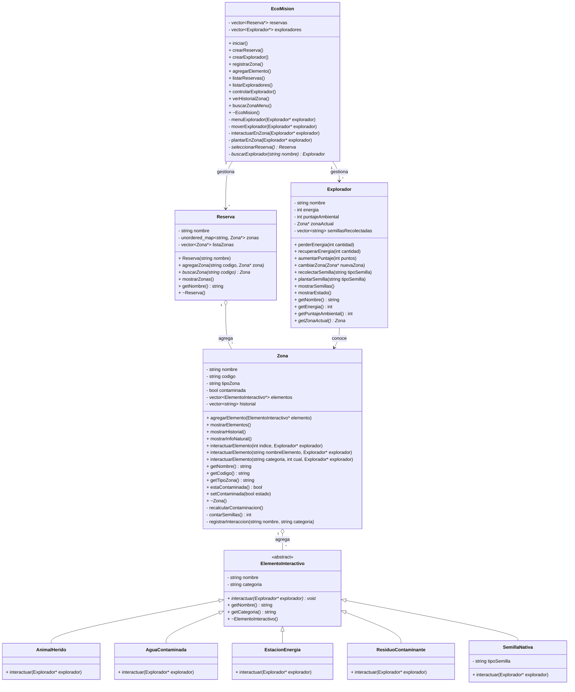

# Diseño del sistema — EcoMisión

---

## Versión inicial (antes de programar)

Diagrama pensado antes de escribir código. Se identificaron las clases principales,
la jerarquía de herencia de `ElementoInteractivo` y las relaciones básicas entre
`EcoMision`, `Reserva`, `Zona` y `Explorador`. En este punto `EcoMision` manejaba
un único explorador y una única reserva.

---

## Versión ajustada (después de comenzar a programar)

Durante el desarrollo se tomaron las primeras decisiones importantes:
se pasó de un único explorador y reserva a colecciones (`vector`), se agregó
`nombre` a `Reserva` para identificarla, se introdujo `mostrarEstado()` en
`Explorador`, y se añadió un menú de explorador con navegación entre zonas.
La contaminación de `Zona` pasó a calcularse automáticamente al agregar
o eliminar elementos, y los elementos desaparecen tras interactuar con ellos.

---

## Versión final (después de terminar)

Versión completa del sistema. Se incorporaron: historial de interacciones en `Zona`,
tercera sobrecarga de `interactuarElemento` por categoría y posición,
`mostrarHistorial()` y `mostrarInfoNatural()` para el requerimiento de
*mostrar cambios en el estado del explorador o de la reserva*, validación
bidireccional de compatibilidad entre tipo de zona y categoría de elemento,
y corrección del conteo de semillas por nombre exacto del elemento.

